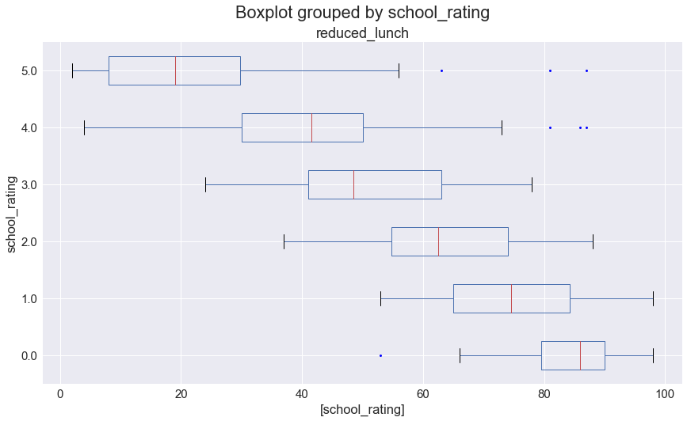
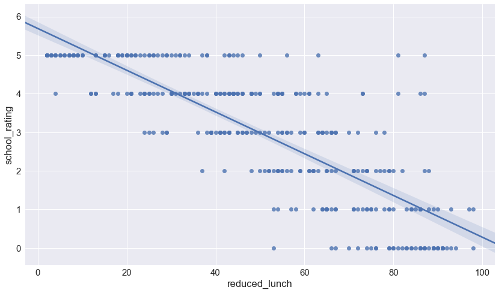
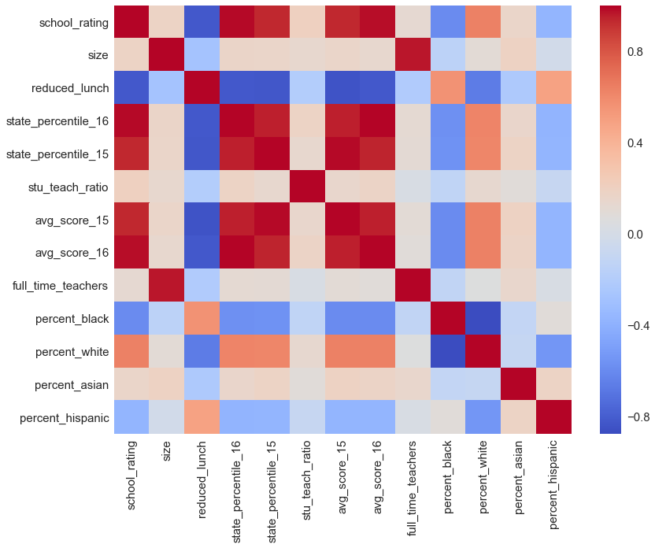

Using middle school data to visualize any correlation to school rating 


```python
import pandas as pd
%matplotlib inline
import matplotlib.pyplot as plt
import seaborn as sns
sns.set_style('darkgrid')
sns.set(font_scale=1.5)
import warnings
warnings.filterwarnings('ignore')
```


```python
# Read in TN middle school dataset from GitHub
df = pd.read_csv('middle_tn_schools.csv')
df.head()
```


<div>
<style scoped>
    .dataframe tbody tr th:only-of-type {
        vertical-align: middle;
    }

    .dataframe tbody tr th {
        vertical-align: top;
    }

    .dataframe thead th {
        text-align: right;
    }
</style>
<table border="1" class="dataframe">
  <thead>
    <tr style="text-align: right;">
      <th></th>
      <th>name</th>
      <th>school_rating</th>
      <th>size</th>
      <th>reduced_lunch</th>
      <th>state_percentile_16</th>
      <th>state_percentile_15</th>
      <th>stu_teach_ratio</th>
      <th>school_type</th>
      <th>avg_score_15</th>
      <th>avg_score_16</th>
      <th>full_time_teachers</th>
      <th>percent_black</th>
      <th>percent_white</th>
      <th>percent_asian</th>
      <th>percent_hispanic</th>
    </tr>
  </thead>
  <tbody>
    <tr>
      <th>0</th>
      <td>Allendale Elementary School</td>
      <td>5.0</td>
      <td>851.0</td>
      <td>10.0</td>
      <td>90.2</td>
      <td>95.8</td>
      <td>15.7</td>
      <td>Public</td>
      <td>89.4</td>
      <td>85.2</td>
      <td>54.0</td>
      <td>2.9</td>
      <td>85.5</td>
      <td>1.6</td>
      <td>5.6</td>
    </tr>
    <tr>
      <th>1</th>
      <td>Anderson Elementary</td>
      <td>2.0</td>
      <td>412.0</td>
      <td>71.0</td>
      <td>32.8</td>
      <td>37.3</td>
      <td>12.8</td>
      <td>Public</td>
      <td>43.0</td>
      <td>38.3</td>
      <td>32.0</td>
      <td>3.9</td>
      <td>86.7</td>
      <td>1.0</td>
      <td>4.9</td>
    </tr>
    <tr>
      <th>2</th>
      <td>Avoca Elementary</td>
      <td>4.0</td>
      <td>482.0</td>
      <td>43.0</td>
      <td>78.4</td>
      <td>83.6</td>
      <td>16.6</td>
      <td>Public</td>
      <td>75.7</td>
      <td>73.0</td>
      <td>29.0</td>
      <td>1.0</td>
      <td>91.5</td>
      <td>1.2</td>
      <td>4.4</td>
    </tr>
    <tr>
      <th>3</th>
      <td>Bailey Middle</td>
      <td>0.0</td>
      <td>394.0</td>
      <td>91.0</td>
      <td>1.6</td>
      <td>1.0</td>
      <td>13.1</td>
      <td>Public Magnet</td>
      <td>2.1</td>
      <td>4.4</td>
      <td>30.0</td>
      <td>80.7</td>
      <td>11.7</td>
      <td>2.3</td>
      <td>4.3</td>
    </tr>
    <tr>
      <th>4</th>
      <td>Barfield Elementary</td>
      <td>4.0</td>
      <td>948.0</td>
      <td>26.0</td>
      <td>85.3</td>
      <td>89.2</td>
      <td>14.8</td>
      <td>Public</td>
      <td>81.3</td>
      <td>79.6</td>
      <td>64.0</td>
      <td>11.8</td>
      <td>71.2</td>
      <td>7.1</td>
      <td>6.0</td>
    </tr>
  </tbody>
</table>
</div>


```python
df.describe()
```


<div>
<style scoped>
    .dataframe tbody tr th:only-of-type {
        vertical-align: middle;
    }

    .dataframe tbody tr th {
        vertical-align: top;
    }

    .dataframe thead th {
        text-align: right;
    }
</style>
<table border="1" class="dataframe">
  <thead>
    <tr style="text-align: right;">
      <th></th>
      <th>school_rating</th>
      <th>size</th>
      <th>reduced_lunch</th>
      <th>state_percentile_16</th>
      <th>state_percentile_15</th>
      <th>stu_teach_ratio</th>
      <th>avg_score_15</th>
      <th>avg_score_16</th>
      <th>full_time_teachers</th>
      <th>percent_black</th>
      <th>percent_white</th>
      <th>percent_asian</th>
      <th>percent_hispanic</th>
    </tr>
  </thead>
  <tbody>
    <tr>
      <th>count</th>
      <td>347.000000</td>
      <td>347.000000</td>
      <td>347.000000</td>
      <td>347.000000</td>
      <td>341.000000</td>
      <td>347.000000</td>
      <td>341.000000</td>
      <td>347.000000</td>
      <td>347.000000</td>
      <td>347.000000</td>
      <td>347.000000</td>
      <td>347.000000</td>
      <td>347.000000</td>
    </tr>
    <tr>
      <th>mean</th>
      <td>2.968300</td>
      <td>699.472622</td>
      <td>50.279539</td>
      <td>58.801729</td>
      <td>58.249267</td>
      <td>15.461671</td>
      <td>57.004692</td>
      <td>57.049856</td>
      <td>44.939481</td>
      <td>21.197983</td>
      <td>61.673487</td>
      <td>2.642651</td>
      <td>11.164553</td>
    </tr>
    <tr>
      <th>std</th>
      <td>1.690377</td>
      <td>400.598636</td>
      <td>25.480236</td>
      <td>32.540747</td>
      <td>32.702630</td>
      <td>5.725170</td>
      <td>26.696450</td>
      <td>27.968974</td>
      <td>22.053386</td>
      <td>23.562538</td>
      <td>27.274859</td>
      <td>3.109629</td>
      <td>12.030608</td>
    </tr>
    <tr>
      <th>min</th>
      <td>0.000000</td>
      <td>53.000000</td>
      <td>2.000000</td>
      <td>0.200000</td>
      <td>0.600000</td>
      <td>4.700000</td>
      <td>1.500000</td>
      <td>0.100000</td>
      <td>2.000000</td>
      <td>0.000000</td>
      <td>1.100000</td>
      <td>0.000000</td>
      <td>0.000000</td>
    </tr>
    <tr>
      <th>25%</th>
      <td>2.000000</td>
      <td>420.500000</td>
      <td>30.000000</td>
      <td>30.950000</td>
      <td>27.100000</td>
      <td>13.700000</td>
      <td>37.600000</td>
      <td>37.000000</td>
      <td>30.000000</td>
      <td>3.600000</td>
      <td>40.600000</td>
      <td>0.750000</td>
      <td>3.800000</td>
    </tr>
    <tr>
      <th>50%</th>
      <td>3.000000</td>
      <td>595.000000</td>
      <td>51.000000</td>
      <td>66.400000</td>
      <td>65.800000</td>
      <td>15.000000</td>
      <td>61.800000</td>
      <td>60.700000</td>
      <td>40.000000</td>
      <td>13.500000</td>
      <td>68.700000</td>
      <td>1.600000</td>
      <td>6.400000</td>
    </tr>
    <tr>
      <th>75%</th>
      <td>4.000000</td>
      <td>851.000000</td>
      <td>71.500000</td>
      <td>88.000000</td>
      <td>88.600000</td>
      <td>16.700000</td>
      <td>79.600000</td>
      <td>80.250000</td>
      <td>54.000000</td>
      <td>28.350000</td>
      <td>85.950000</td>
      <td>3.100000</td>
      <td>13.800000</td>
    </tr>
    <tr>
      <th>max</th>
      <td>5.000000</td>
      <td>2314.000000</td>
      <td>98.000000</td>
      <td>99.800000</td>
      <td>99.800000</td>
      <td>111.000000</td>
      <td>99.000000</td>
      <td>98.900000</td>
      <td>140.000000</td>
      <td>97.400000</td>
      <td>99.700000</td>
      <td>21.100000</td>
      <td>65.200000</td>
    </tr>
  </tbody>
</table>
</div>


```python
df[['reduced_lunch', 'school_rating']].groupby(['school_rating']).describe()
```


<div>
<style scoped>
    .dataframe tbody tr th:only-of-type {
        vertical-align: middle;
    }

    .dataframe tbody tr th {
        vertical-align: top;
    }

    .dataframe thead tr th {
        text-align: left;
    }

    .dataframe thead tr:last-of-type th {
        text-align: right;
    }
</style>
<table border="1" class="dataframe">
  <thead>
    <tr>
      <th></th>
      <th colspan="8" halign="left">reduced_lunch</th>
    </tr>
    <tr>
      <th></th>
      <th>count</th>
      <th>mean</th>
      <th>std</th>
      <th>min</th>
      <th>25%</th>
      <th>50%</th>
      <th>75%</th>
      <th>max</th>
    </tr>
    <tr>
      <th>school_rating</th>
      <th></th>
      <th></th>
      <th></th>
      <th></th>
      <th></th>
      <th></th>
      <th></th>
      <th></th>
    </tr>
  </thead>
  <tbody>
    <tr>
      <th>0.0</th>
      <td>43.0</td>
      <td>83.581395</td>
      <td>8.813498</td>
      <td>53.0</td>
      <td>79.50</td>
      <td>86.0</td>
      <td>90.00</td>
      <td>98.0</td>
    </tr>
    <tr>
      <th>1.0</th>
      <td>40.0</td>
      <td>74.950000</td>
      <td>11.644191</td>
      <td>53.0</td>
      <td>65.00</td>
      <td>74.5</td>
      <td>84.25</td>
      <td>98.0</td>
    </tr>
    <tr>
      <th>2.0</th>
      <td>44.0</td>
      <td>64.272727</td>
      <td>11.956051</td>
      <td>37.0</td>
      <td>54.75</td>
      <td>62.5</td>
      <td>74.00</td>
      <td>88.0</td>
    </tr>
    <tr>
      <th>3.0</th>
      <td>56.0</td>
      <td>50.285714</td>
      <td>13.550866</td>
      <td>24.0</td>
      <td>41.00</td>
      <td>48.5</td>
      <td>63.00</td>
      <td>78.0</td>
    </tr>
    <tr>
      <th>4.0</th>
      <td>86.0</td>
      <td>41.000000</td>
      <td>16.681092</td>
      <td>4.0</td>
      <td>30.00</td>
      <td>41.5</td>
      <td>50.00</td>
      <td>87.0</td>
    </tr>
    <tr>
      <th>5.0</th>
      <td>78.0</td>
      <td>21.602564</td>
      <td>17.651268</td>
      <td>2.0</td>
      <td>8.00</td>
      <td>19.0</td>
      <td>29.75</td>
      <td>87.0</td>
    </tr>
  </tbody>
</table>
</div>


```python
# only view these two variables
df[['reduced_lunch', 'school_rating']].corr()
```


<div>
<style scoped>
    .dataframe tbody tr th:only-of-type {
        vertical-align: middle;
    }

    .dataframe tbody tr th {
        vertical-align: top;
    }

    .dataframe thead th {
        text-align: right;
    }
</style>
<table border="1" class="dataframe">
  <thead>
    <tr style="text-align: right;">
      <th></th>
      <th>reduced_lunch</th>
      <th>school_rating</th>
    </tr>
  </thead>
  <tbody>
    <tr>
      <th>reduced_lunch</th>
      <td>1.000000</td>
      <td>-0.815757</td>
    </tr>
    <tr>
      <th>school_rating</th>
      <td>-0.815757</td>
      <td>1.000000</td>
    </tr>
  </tbody>
</table>
</div>


```python
fig, ax = plt.subplots(figsize=(14,8))

ax.set_ylabel('school_rating')

# boxplot with only these two variables
_ = df[['reduced_lunch', 'school_rating']].boxplot(by='school_rating', figsize=(13,8), vert=False, sym='b.', ax=ax)

plt.savefig('boxplot_school_rating.png')
```





```python
plt.figure(figsize=(14,8))
_ = sns.regplot(data=df, x='reduced_lunch', y='school_rating')

plt.savefig('scatterplot.png')
```





```python
# create tabular correlation matrix
corr = df.corr()
_, ax = plt.subplots(figsize=(13,10)) 

# graph correlation matrix
_ = sns.heatmap(corr, ax=ax,
                xticklabels=corr.columns.values,
                yticklabels=corr.columns.values,
                cmap='coolwarm')

plt.savefig('correlation_matrix.png')
```




